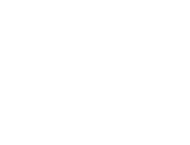
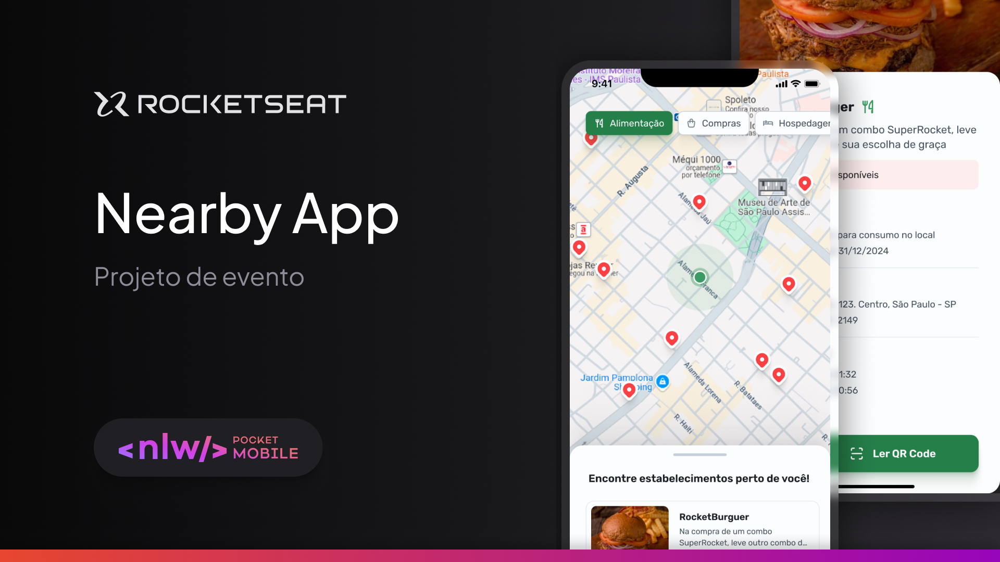
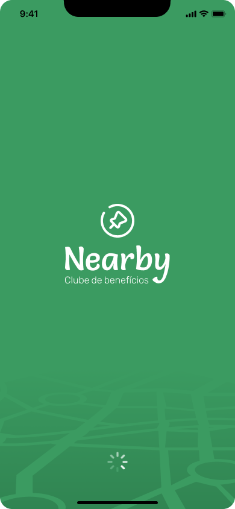
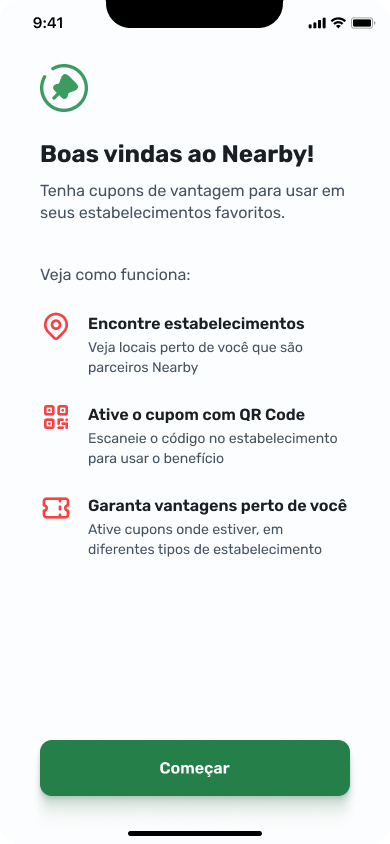
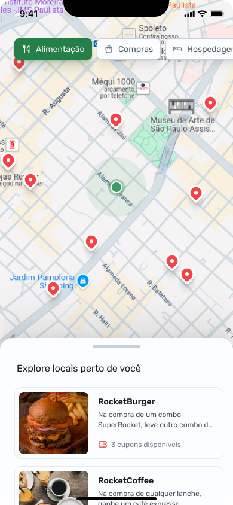
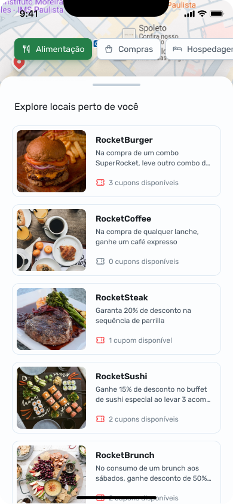
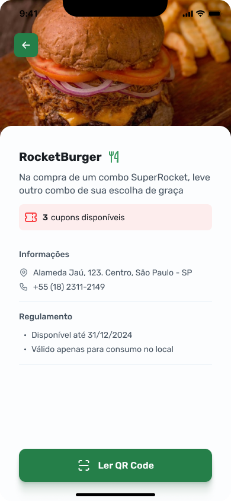
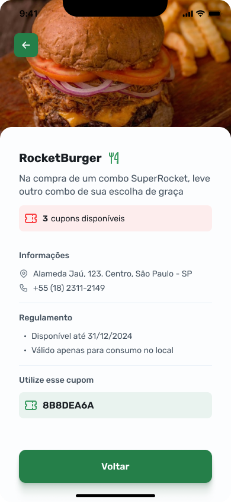

<h1 align="center">
  
</h1>

<p align="center">
  

  

  
  
  <a href="https://github.com/pabloxt14/nlw-pocket-mobile-rn/commits/master">
    
  </a>
    
   

   <a href="https://github.com/pabloxt14/nlw-pocket-mobile-rn/stargazers">
    
  </a>
</p>

<p>
  
</p>

<h4 align="center"> 
	🚀 Aplicação finalizada 🚀
</h4>

<p align="center">
 <a href="#-about">About</a> | 
 <a href="#-layout">Layout</a> | 
 <a href="#-setup">Setup</a> | 
 <a href="#-technologies">Technologies</a> | 
 <a href="#-license">License</a>
</p>


## 💻 About

Esta aplicação de nome **Nearby** consiste em um aplicativo mobile de clube de benefícios com cupons para utilizar em estabelecimentos próximos a você.

Os principais conhecimentos aplicados nesta aplicação foram:
- Uso de mapas no React Native;
- Implementação de componente de Bottom Sheet;
- Leitura de QR Code;

Todavia, essa aplicação foi desenvolvida durante o NLW Pocket Mobile da [Rocketseat](https://www.rocketseat.com.br/) utilizando principalmente tecnologias como `React Native`, `Expo` e `TypeScript`.


<!-- ## 🔗 Deploy

O deploy da aplicação pode ser acessada através da seguinte URL base: https://pabloxt14-nlw-expert-notes.vercel.app/ -->


## 🎨 Layout

Você pode visualizar o layout do projeto através [desse link](https://www.figma.com/community/file/1448070647757721748). É necessário ter conta no [Figma](https://www.figma.com/) para acessá-lo.

A seguir, veja uma demonstração das principais telas da aplicação:

### Splash

<p align="center">
  
</p>

### Start

<p align="center">
  
</p>

### Home

<p align="center">
  
</p>

### Home List

<p align="center">
  
</p>

### Details

<p align="center">
  
</p>

### Details Coupon

<p align="center">
  
</p>


## ⚙ Setup

### 📝 Requisites

Antes de baixar o projeto você vai precisar ter instalado na sua máquina as seguintes ferramentas:

* [Git](https://git-scm.com)
* [NodeJS](https://nodejs.org/en/)
* [NPM](https://www.npmjs.com/) ou [Yarn](https://yarnpkg.com/) 
* Para reproduzir o acesso a API back-end com os dados necessários para o front-end, clone o seguinte [repositório](https://github.com/pabloxt14/nlw-journey-node) que contem a API do nosso back-end feita em Node.js e execute na sua máquina.

Além disto é bom ter um editor para trabalhar com o código como [VSCode](https://code.visualstudio.com/)

### Cloning and Running

Passo a passo para clonar e executar a aplicação na sua máquina:

```bash
# Clone este repositório
$ git clone git@github.com:pabloxt14/nlw-pocket-mobile-rn.git

# Acesse a pasta do projeto no terminal
$ cd nlw-pocket-mobile-rn/mobile

# Instale as dependências
$ npm install

# Execute a API back-end
$ cd ../api
$ npm install
$ npm run start

# Execute a aplicação em modo de desenvolvimento
$ npm run start
```


## 🛠 Technologies

As seguintes principais ferramentas foram usadas na construção do projeto:

- **[React Native](https://reactnative.dev/)**
- **[Expo](https://expo.dev/)**
- **[TypeScript](https://www.typescriptlang.org/)**
- **[Table Icons](https://tabler.io/docs/icons/react-native)**
- **[Axios](https://axios-http.com/ptbr/docs/intro)**
- **[Bottom Sheet](https://github.com/gorhom/react-native-bottom-sheet)**
- **[React Native Maps](https://docs.expo.dev/versions/latest/sdk/map-view/)**
- **[Expo Camera](https://docs.expo.dev/versions/latest/sdk/camera/)**

> Para mais detalhes das dependências gerais da aplicação veja o arquivo [package.json](./mobile/package.json)


## 📝 License

Este projeto está sob a licença MIT. Consulte o arquivo [LICENSE](./LICENSE) para mais informações

<p align="center">
  Feito com 💜 por Pablo Alan 👋🏽 <a href="https://www.linkedin.com/in/pabloalan/" target="_blank">Entre em contato!</a>  
</p>